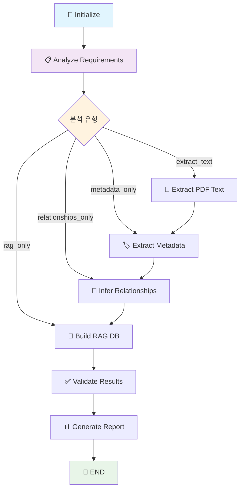
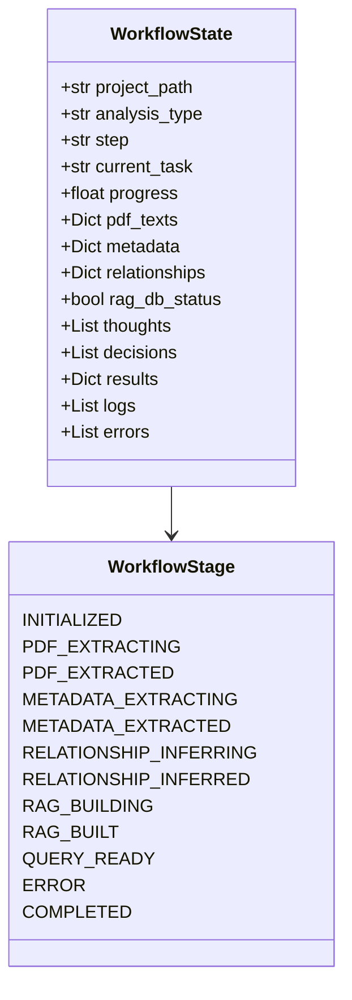
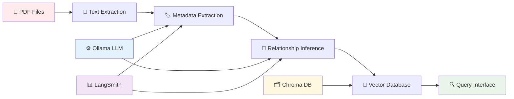

# 🏗️ VLM 건축 도면 분석 시스템 워크플로우 구조 리포트

> **생성일**: 2025-06-17  
> **버전**: v1.0  
> **분석 대상**: `/home/ubuntu-lynn/VLM` 프로젝트

---

## 📋 개요

VLM(Vision Language Model) 건축 도면 분석 시스템은 LangGraph 기반의 워크플로우를 통해 건축 도면의 메타데이터 추출, 관계 추론, RAG 데이터베이스 구축을 자동화하는 시스템입니다.

### 🎯 주요 기능
- PDF 도면 파일 텍스트 추출
- LLM 기반 메타데이터 추출 
- 도면 간 관계 추론
- RAG 데이터베이스 구축
- 인터랙티브 쿼리 인터페이스

---

## 🔧 기술 스택

### 핵심 기술
- **LLM 백엔드**: Ollama (gemma2:12b-it-qat)
- **워크플로우**: LangGraph (StateGraph)
- **추적/관찰**: LangSmith
- **문서 처리**: PyPDF, pypdf
- **벡터 DB**: Chroma
- **임베딩**: HuggingFace Embeddings

### 아키텍처 패턴
- **State Management**: TypedDict 기반 상태 관리
- **Conditional Routing**: 분석 유형별 조건부 라우팅
- **Error Handling**: 단계별 오류 수집 및 추적
- **Progress Tracking**: 실시간 진행률 모니터링

---

## 🌊 워크플로우 구조

### 1. 메인 워크플로우 (ArchitecturalAnalysisWorkflow)



### 2. 상태 정의 (WorkflowState)



---

## 🏗️ 시스템 컴포넌트 구조

### 1. 핵심 모듈 구조

```
📦 VLM System
├── 🎛️ architectural_workflow.py     # 메인 워크플로우 오케스트레이터
├── 📈 langgraph_workflow.py         # LangGraph 확장 워크플로우
├── 🔧 src/
│   ├── 🏷️ llm_metadata_extractor.py     # LLM 기반 메타데이터 추출
│   ├── 🔗 llm_relationship_inferencer.py # 관계 추론 엔진
│   ├── ⚙️ env_config.py                 # 환경 설정 관리
│   ├── 📊 langsmith_integration.py      # LangSmith 추적 통합
│   ├── 🗂️ workflow_state.py             # 워크플로우 상태 정의
│   └── 🖥️ vllm_config.py               # vLLM 설정 (deprecated)
├── 📄 extract_metadata.py          # 메타데이터 추출 스크립트
├── 🔗 infer_relationships.py       # 관계 추론 스크립트  
├── 💾 build_rag_db.py             # RAG DB 구축 스크립트
├── 🔍 query_rag.py                # RAG 쿼리 인터페이스
└── 📝 analyze_uploads_new.py       # 업로드 파일 분석
```

### 2. 데이터 플로우



---

## ⚡ 워크플로우 실행 흐름

### 1. 초기화 단계
```python
# 1. 환경 설정 로드
env_config = get_env_config()

# 2. 워크플로우 상태 초기화
initial_state = WorkflowState(
    project_path="./",
    analysis_type="full|metadata_only|relationships_only|rag_only",
    progress=0.0,
    ...
)
```

### 2. 조건부 라우팅
```python
def route_next_step(state: WorkflowState) -> str:
    analysis_type = state["analysis_type"]
    
    if analysis_type == "full":
        return "extract_text"
    elif analysis_type == "metadata_only":
        return "metadata_only"
    elif analysis_type == "relationships_only":
        return "relationships_only"
    elif analysis_type == "rag_only":
        return "rag_only"
```

### 3. 단계별 처리

#### 📄 PDF 텍스트 추출
- **입력**: PDF 파일 경로
- **처리**: pypdf를 사용한 텍스트 추출
- **출력**: 추출된 텍스트 데이터

#### 🏷️ 메타데이터 추출  
- **입력**: 추출된 텍스트
- **처리**: Ollama LLM을 통한 구조화된 메타데이터 추출
- **출력**: JSON 형태의 메타데이터

#### 🔗 관계 추론
- **입력**: 메타데이터 집합
- **처리**: LLM 기반 도면 간 관계 분석
- **출력**: 관계 그래프 데이터

#### 💾 RAG DB 구축
- **입력**: 텍스트 + 메타데이터
- **처리**: Chroma DB에 벡터 임베딩 저장
- **출력**: 쿼리 가능한 벡터 데이터베이스

---

## 🎛️ 설정 및 환경 변수

### 필수 환경 변수
```bash
# Ollama 설정
DEFAULT_MODEL=gemma2:12b-it-qat
OLLAMA_BASE_URL=http://localhost:11434
OLLAMA_TIMEOUT=120

# LangSmith 추적
LANGSMITH_API_KEY=your_api_key
LANGSMITH_PROJECT=UOS-vllm-rag-chatbot
LANGSMITH_TRACING=true

# 시스템 설정
UPLOADS_DIR=uploads
VECTOR_DB_PATH=./chroma_db
MAX_FILE_SIZE_MB=100
```

### LLM 프롬프트 설정
- **메타데이터 추출**: 구조화된 JSON 출력 프롬프트
- **관계 추론**: 도면 간 연관성 분석 프롬프트
- **쿼리 응답**: 사용자 질의에 대한 상황별 응답 프롬프트

---

## 📊 모니터링 및 추적

### LangSmith 통합
```python
@traceable(name="extract_metadata")
def extract_metadata_with_llm(text: str) -> Dict[str, Any]:
    # LangSmith가 자동으로 실행 추적
    pass

@traceable(name="infer_relationships") 
def infer_relationships_with_llm(metadata: List[Dict]) -> List[Dict]:
    # 관계 추론 과정 추적
    pass
```

### 진행률 추적
- **초기화**: 0%
- **텍스트 추출**: 20%
- **메타데이터 추출**: 50%
- **관계 추론**: 80%
- **RAG DB 구축**: 95%
- **완료**: 100%

---

## 🚀 사용 방법

### 1. 기본 실행
```bash
# 전체 분석
python architectural_workflow.py /path/to/project --analysis-type full

# 메타데이터만 추출
python architectural_workflow.py /path/to/project --analysis-type metadata_only

# 관계만 추론
python architectural_workflow.py /path/to/project --analysis-type relationships_only

# RAG DB만 구축
python architectural_workflow.py /path/to/project --analysis-type rag_only
```

### 2. 개별 스크립트 실행
```bash
# 메타데이터 추출
python extract_metadata.py

# 관계 추론
python infer_relationships.py --use-llm

# RAG DB 구축
python build_rag_db.py

# 쿼리 실행
python query_rag.py
```

### 3. 테스트 실행
```bash
# Ollama 연동 테스트
python test_ollama_integration.py

# LangSmith 추적 테스트
python test_langsmith_integration.py
```

---

## 📈 성능 특성

### 처리 시간 (예상)
- **PDF 텍스트 추출**: ~5초/파일
- **메타데이터 추출**: ~10-30초/파일 (LLM 의존)
- **관계 추론**: ~20-60초 (파일 수 의존)
- **RAG DB 구축**: ~10-30초 (데이터 크기 의존)

### 메모리 사용량
- **Ollama 모델**: ~8-12GB (gemma2:12b-it-qat)
- **워크플로우 실행**: ~500MB-2GB
- **벡터 DB**: 파일 크기에 비례

### 확장성
- **수평 확장**: 파일별 병렬 처리 가능
- **수직 확장**: GPU 메모리에 따른 모델 크기 조정
- **캐싱**: LLM 응답 캐싱으로 성능 향상

---

## 🔧 확장 포인트

### 1. 새로운 분석 유형 추가
```python
# workflow에 새 노드 추가
workflow.add_node("new_analysis", self.new_analysis_method)

# 라우팅 로직 확장
def route_next_step(state: WorkflowState) -> str:
    if state["analysis_type"] == "new_analysis":
        return "new_analysis"
```

### 2. 다른 LLM 백엔드 지원
```python
# src/llm_backend_adapter.py
class LLMBackendAdapter:
    def get_llm(self, backend_type: str):
        if backend_type == "ollama":
            return ChatOllama(...)
        elif backend_type == "openai":
            return ChatOpenAI(...)
        elif backend_type == "anthropic":
            return ChatAnthropic(...)
```

### 3. 추가 문서 형식 지원
```python
# extract_document.py
class DocumentExtractor:
    def extract(self, file_path: str) -> str:
        if file_path.endswith('.pdf'):
            return self.extract_pdf(file_path)
        elif file_path.endswith('.docx'):
            return self.extract_docx(file_path)
        elif file_path.endswith('.dwg'):
            return self.extract_dwg(file_path)
```

---

## 🛡️ 오류 처리 및 복구

### 오류 유형별 처리
- **LLM 연결 오류**: 재시도 로직 + 폴백 모델
- **파일 처리 오류**: 개별 파일 스킵 + 오류 로그
- **메모리 부족**: 배치 크기 자동 조정
- **네트워크 오류**: 지수 백오프 재시도

### 복구 전략
```python
def handle_llm_error(func):
    def wrapper(*args, **kwargs):
        for attempt in range(3):
            try:
                return func(*args, **kwargs)
            except Exception as e:
                if attempt == 2:  # 마지막 시도
                    state["errors"].append(f"LLM 호출 실패: {str(e)}")
                    return None
                time.sleep(2 ** attempt)  # 지수 백오프
    return wrapper
```

---

## 📋 결론

VLM 건축 도면 분석 시스템은 현대적인 LLM과 워크플로우 오케스트레이션 기술을 활용하여 건축 도면 분석을 자동화하는 종합적인 솔루션입니다.

### 주요 강점
- ✅ **모듈형 설계**: 각 단계별 독립적 실행 가능
- ✅ **조건부 라우팅**: 분석 유형별 최적화된 경로
- ✅ **실시간 추적**: LangSmith 통합 관찰 가능성
- ✅ **확장 가능**: 새로운 분석 유형 및 백엔드 쉽게 추가
- ✅ **오류 복구**: 강건한 오류 처리 및 재시도 메커니즘

### 향후 개선 방향
- 🔄 **스트리밍 처리**: 대용량 파일 실시간 처리
- 🌐 **웹 인터페이스**: 사용자 친화적 대시보드
- 📊 **상세 분석**: 도면 품질 평가 및 개선 제안
- 🔧 **API화**: RESTful API로 외부 시스템 연동
- 🏗️ **배포 최적화**: Docker 컨테이너화 및 클라우드 배포

---

*이 리포트는 2025-06-17 기준으로 작성되었으며, 시스템 업데이트에 따라 내용이 변경될 수 있습니다.*
